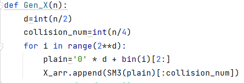
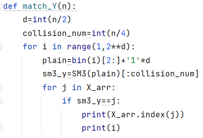
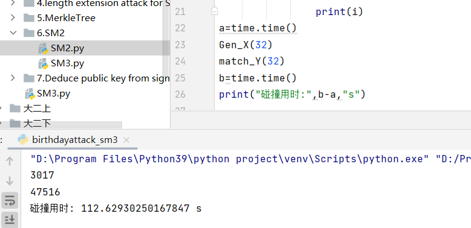

# 生日攻击
## 简介
输出是256位,我们随机地选择输入，并计算哈希值，在检验第2^256+1个输入之前便很可能找到碰撞。
实际上，如果我们随机选择2^130+1个输入，找到至少两个相同哈希值的概率为99.8%。
仅仅通过检验可能输出数量的平方根次数，便大体能找到碰撞，这在概率论中称为生日悖论（birthday paradox）。
## 项目说明

### 创建一个列表用来存放第一种信息表示的hash值

### 对另一种信息表示作hash并在列表里搜索

## 实验结果
 ### 32bit碰撞:

